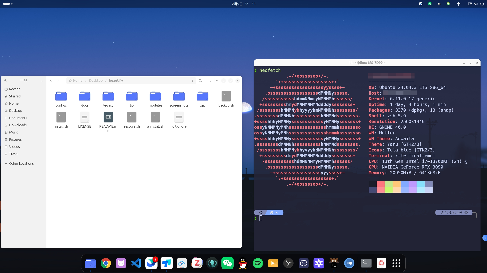

# ubuntu-rice

One-click Ubuntu GNOME desktop beautification toolkit.


> Transform your Ubuntu desktop with a single command. Interactive TUI for selective component installation.

## Screenshots



## Features

| Component | Description | 20.04 | 22.04 | 24.04 |
|-----------|-------------|:-----:|:-----:|:-----:|
| Ghostty | Modern GPU-accelerated terminal (Mitchell Hashimoto) | no | yes | yes |
| Nerd Fonts | MesloLGS NF font family | yes | yes | yes |
| Zsh | Oh-My-Zsh + Powerlevel10k + plugins | yes | yes | yes |
| Fcitx5 | Chinese input method (pinyin) | PPA | yes | yes |
| Orchis | GTK theme | yes | yes | yes |
| Tela | Icon theme (blue variant) | yes | yes | yes |
| Bibata | Cursor theme (Modern Ice) | yes | yes | yes |
| GNOME Extensions | Extension Manager + recommended extensions | yes | yes | yes |
| GNOME Settings | Appearance, fonts, and scaling | yes | yes | yes |

## Quick Start

```bash
git clone https://github.com/limx/ubuntu-rice.git
cd ubuntu-rice
./install.sh
```

The interactive TUI lets you select which components to install.

## Project Structure

```
ubuntu-rice/
├── install.sh          # Main installer (TUI-based)
├── uninstall.sh        # Component uninstaller
├── backup.sh           # Back up current configs
├── restore.sh          # Restore configs from backup
├── lib/
│   ├── utils.sh        # Logging, config resolution, helpers
│   ├── distro.sh       # Ubuntu/GNOME version detection
│   └── tui.sh          # Whiptail TUI wrappers
├── modules/
│   ├── ghostty.sh      # Ghostty terminal
│   ├── fonts.sh        # Nerd Fonts
│   ├── zsh.sh          # Zsh + Oh-My-Zsh + p10k
│   ├── fcitx5.sh       # Fcitx5 input method
│   ├── theme.sh        # Orchis GTK + Tela icons + Bibata cursor
│   ├── gnome-extensions.sh  # GNOME Shell extensions
│   └── gnome-settings.sh   # Desktop appearance settings
└── configs/
    ├── default/        # Default configs shipped with the project
    │   ├── ghostty/
    │   ├── zsh/
    │   ├── fcitx5/
    │   ├── gnome_settings/
    │   └── gnome_extensions/
    └── custom/         # User overrides (gitignored)
```

## Custom Configuration

Place your config files in `configs/custom/` to override defaults. The installer
automatically prefers `configs/custom/<module>/` over `configs/default/<module>/`.

```
configs/custom/
├── ghostty/config
├── zsh/zshrc
├── fcitx5/classicui.conf
└── gnome/interface.dconf
```

## Backup & Restore

```bash
# Back up current desktop configs
./backup.sh

# Restore from ~/ubuntu-rice-configs/
./restore.sh

# Restore from a specific archive
./restore.sh ~/ubuntu-rice-backup-20260209_120000.tar.gz
```

The backup script saves Ghostty, Zsh, Fcitx5, and GNOME settings into a
timestamped `.tar.gz` archive.

## Uninstall

```bash
./uninstall.sh
```

The TUI lets you select which components to remove.

## Module Development

Each module is a standalone shell script in `modules/` that follows a naming
convention. The installer discovers and loads modules automatically.

```bash
# modules/example.sh

# Required: human-readable name (variable, not function)
example_name="Example Module"

# Required: short description (variable, not function)
example_desc="Does something useful"

# Optional: return 0 if supported, 1 otherwise
example_check() { command -v example &>/dev/null; }

# Required: install the component
example_install() {
    local ver="$1"  # Ubuntu version (20.04, 22.04, 24.04)
    sudo apt-get install -y example-pkg
}

# Required: uninstall the component
example_uninstall() {
    sudo apt-get remove -y example-pkg
}

# Optional: apply config files from configs/{custom,default}/example/
example_apply_config() {
    local config_src="$1"  # resolved config directory
    cp "$config_src/example.conf" ~/.config/example/
}
```

## Contributing

1. Fork the repository
2. Create a module in `modules/` following the template above
3. Add default configs in `configs/default/<module>/`
4. Submit a pull request

## License

[MIT](LICENSE)
